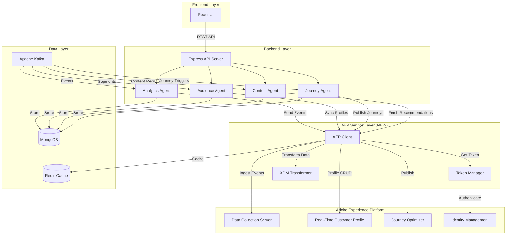
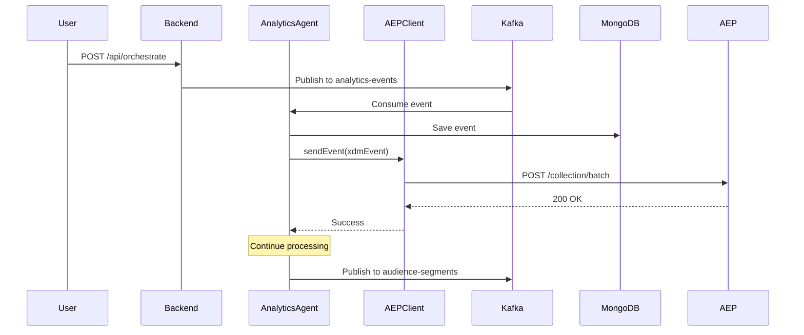

# Design Document: Adobe Experience Platform (AEP) Integration

## Overview

This design document describes the technical architecture for integrating Adobe Experience Platform (AEP) into the Agent Weaver multi-agent orchestration platform. The integration adds enterprise-grade customer data platform capabilities while maintaining backward compatibility with all existing features.

### Integration Approach

The AEP integration follows an **enhancement layer pattern** where:
- All existing functionality remains unchanged
- AEP operations run asynchronously and never block the core Kafka pipeline
- The system operates normally when AEP credentials are not configured (graceful degradation)
- AEP features are additive - they enrich agent decisions but don't replace existing logic

### Key Design Principles

1. **Non-Breaking**: Existing Kafka → Agent → MongoDB flow is preserved
2. **Asynchronous**: AEP API calls don't block event processing
3. **Fault-Tolerant**: AEP failures don't crash agents or stop the pipeline
4. **Observable**: All AEP operations are logged and monitored
5. **Testable**: Mock AEP client available for testing
6. **Secure**: OAuth 2.0 JWT authentication with automatic token refresh

## Architecture

### High-Level Architecture Diagram



### Data Flow Diagram



## Components and Interfaces

### 1. Token Manager Service

**File**: `backend/services/aep/TokenManager.js`

**Purpose**: Manages OAuth 2.0 JWT authentication with Adobe IMS

**Key Methods**:
```javascript
class TokenManager {
  constructor(config)
  async initialize()
  async getValidToken()
  async refreshToken()
  isTokenValid()
  enableGracefulDegradation()
}
```

**Configuration**:
```javascript
{
  apiKey: process.env.ADOBE_API_KEY,
  orgId: process.env.ADOBE_ORG_ID,
  techAccount: process.env.ADOBE_TECH_ACCOUNT,
  privateKey: process.env.ADOBE_PRIVATE_KEY,
  imsEndpoint: process.env.ADOBE_IMS_ENDPOINT || 'https://ims-na1.adobelogin.com'
}
```

**Authentication Flow**:
1. Generate JWT token using private key and technical account credentials
2. Exchange JWT for OAuth 2.0 access token via Adobe IMS
3. Cache access token in Redis with TTL = expiration - 5 minutes
4. Automatically refresh token before expiration
5. On failure, retry with exponential backoff (1s, 2s, 4s)
6. After 3 failures, enable graceful degradation mode

**Error Handling**:
- Missing credentials → Log warning, enable graceful degradation
- Invalid credentials → Log error, enable graceful degradation
- Network errors → Retry with backoff
- Token expired → Automatic refresh

### 2. XDM Transformer Service

**File**: `backend/services/aep/XDMTransformer.js`

**Purpose**: Transforms Agent Weaver data models to Adobe XDM format

**Key Methods**:
```javascript
class XDMTransformer {
  transformAudience(audienceDoc)
  transformAnalyticsEvent(eventDoc)
  transformJourney(journeyDoc)
  transformContent(contentDoc)
  validateXDM(xdmDoc, schemaType)
}
```

**Schema Mappings**:

#### Audience → XDM Profile
```javascript
{
  identityMap: {
    ECID: [{ id: audienceDoc.audienceId }]
  },
  person: {
    name: { fullName: audienceDoc.name }
  },
  segmentMembership: {
    [audienceDoc.segment]: {
      status: "realized",
      lastQualificationTime: audienceDoc.createdAt
    }
  },
  _agentWeaver: {
    userCategory: audienceDoc.userCategory,
    score: audienceDoc.score,
    attributes: audienceDoc.attributes
  }
}
```

#### AnalyticsEvent → XDM ExperienceEvent
```javascript
{
  _id: eventDoc.analyticsId,
  timestamp: eventDoc.timestamp,
  eventType: `agentWeaver.${eventDoc.eventType}`,
  identityMap: {
    ECID: [{ id: eventDoc.userId }]
  },
  commerce: {
    productViews: { value: eventDoc.eventType === 'view' ? 1 : 0 }
  },
  web: {
    webPageDetails: {
      name: eventDoc.contentId,
      pageViews: { value: 1 }
    }
  },
  _agentWeaver: {
    journeyId: eventDoc.journeyId,
    audienceId: eventDoc.audienceId,
    contentId: eventDoc.contentId,
    userCategory: eventDoc.userCategory,
    data: eventDoc.data
  }
}
```

#### Journey → Custom XDM Schema
```javascript
{
  _id: journeyDoc.journeyId,
  name: journeyDoc.name,
  status: journeyDoc.status,
  audienceSegment: journeyDoc.audienceSegment,
  steps: journeyDoc.steps.map(step => ({
    stepId: step.stepId,
    type: step.type,
    sequence: step.sequence,
    condition: step.condition
  })),
  _agentWeaver: {
    surveyEnabled: journeyDoc.surveyEnabled,
    personalizedTrainingEnabled: journeyDoc.personalizedTrainingEnabled
  }
}
```

**Validation**:
- Check required fields are present
- Validate data types match XDM schema
- Ensure timestamp is ISO 8601 format
- Validate identityMap has at least one identity
- Return null if validation fails

### 3. AEP Client Service

**File**: `backend/services/aep/AEPClient.js`

**Purpose**: Centralized client for all Adobe Experience Platform API calls

**Key Methods**:
```javascript
class AEPClient {
  constructor(tokenManager, xdmTransformer, config)
  async sendEvent(event)
  async sendBatchEvents(events)
  async fetchProfile(userId)
  async createProfile(profileData)
  async updateProfile(userId, updates)
  async publishJourney(journeyData)
  async deleteProfile(userId)
  isEnabled()
}
```

**Configuration**:
```javascript
{
  dcsEndpoint: process.env.ADOBE_DCS_ENDPOINT || 'https://dcs.adobedc.net',
  datasetId: process.env.ADOBE_DATASET_ID,
  sandboxName: process.env.ADOBE_SANDBOX_NAME || 'prod',
  timeout: 30000,
  retryAttempts: 3,
  retryDelay: 1000
}
```

**API Endpoints Used**:
- **Data Collection**: `POST /collection/batch` - Ingest events
- **Profile API**: `GET/POST/PATCH /data/core/ups/access/entities` - Profile CRUD
- **Journey Orchestration**: `POST /journey/manage/journeys` - Publish journeys
- **Segment API**: `POST /segment/definitions` - Create segments

**Request Headers**:
```javascript
{
  'Authorization': `Bearer ${accessToken}`,
  'x-api-key': config.apiKey,
  'x-gw-ims-org-id': config.orgId,
  'x-sandbox-name': config.sandboxName,
  'Content-Type': 'application/json'
}
```

**Retry Logic**:
```javascript
async function retryWithBackoff(fn, maxRetries = 3) {
  for (let i = 0; i < maxRetries; i++) {
    try {
      return await fn();
    } catch (error) {
      if (i === maxRetries - 1) throw error;
      if (error.response?.status === 429 || error.response?.status === 503) {
        const delay = Math.pow(2, i) * 1000; // 1s, 2s, 4s
        await sleep(delay);
      } else {
        throw error; // Don't retry on 4xx errors
      }
    }
  }
}
```

**Batch Event Processing**:
```javascript
class EventBatcher {
  constructor(maxSize = 100, flushInterval = 5000) {
    this.buffer = [];
    this.maxSize = maxSize;
    this.flushInterval = flushInterval;
    this.timer = null;
  }

  add(event) {
    this.buffer.push(event);
    if (this.buffer.length >= this.maxSize) {
      this.flush();
    } else if (!this.timer) {
      this.timer = setTimeout(() => this.flush(), this.flushInterval);
    }
  }

  async flush() {
    if (this.buffer.length === 0) return;
    const batch = this.buffer.splice(0, this.maxSize);
    clearTimeout(this.timer);
    this.timer = null;
    await aepClient.sendBatchEvents(batch);
  }
}
```

### 4. Agent Modifications

#### Analytics Agent Enhancements

**File**: `backend/server.js` (AnalyticsAgent class)

**New Methods**:
```javascript
async sendEventToAEP(eventData) {
  if (!aepClient.isEnabled()) return;
  
  try {
    const xdmEvent = xdmTransformer.transformAnalyticsEvent(eventData);
    if (!xdmEvent) {
      logger.warn('XDM transformation failed', { eventData });
      return;
    }
    
    eventBatcher.add(xdmEvent);
    logger.debug('Event queued for AEP', { analyticsId: eventData.analyticsId });
  } catch (error) {
    logger.error('Failed to send event to AEP', { error, eventData });
    // Don't throw - graceful degradation
  }
}
```

**Modified Kafka Consumer**:
```javascript
async startKafkaConsumer() {
  await kafkaConsumer.subscribe({ topic: 'analytics-events', fromBeginning: true });
  await kafkaConsumer.run({
    eachMessage: async ({ message }) => {
      const data = JSON.parse(message.value.toString());
      
      // Existing flow (unchanged)
      const segment = analyzeBehavior(data);
      await this.saveToMongoDB(data, segment);
      
      // NEW: Send to AEP asynchronously
      this.sendEventToAEP(data).catch(err => 
        logger.error('AEP event send failed', { err })
      );
      
      // Continue existing flow
      await this.publishToKafka('audience-segments', segment);
    }
  });
}
```

#### Audience Agent Enhancements

**File**: `backend/server.js` (AudienceAgent class)

**New Methods**:
```javascript
async syncProfileToAEP(audienceDoc) {
  if (!aepClient.isEnabled()) return;
  
  try {
    const xdmProfile = xdmTransformer.transformAudience(audienceDoc);
    if (!xdmProfile) {
      await Audience.updateOne(
        { audienceId: audienceDoc.audienceId },
        { aepSyncStatus: 'failed', aepSyncedAt: new Date() }
      );
      return;
    }
    
    const result = await aepClient.createProfile(xdmProfile);
    
    await Audience.updateOne(
      { audienceId: audienceDoc.audienceId },
      { 
        aepProfileId: result.profileId,
        aepSyncStatus: 'synced',
        aepSyncedAt: new Date()
      }
    );
    
    logger.info('Audience synced to AEP', { 
      audienceId: audienceDoc.audienceId,
      aepProfileId: result.profileId
    });
  } catch (error) {
    logger.error('Failed to sync audience to AEP', { error, audienceDoc });
    await Audience.updateOne(
      { audienceId: audienceDoc.audienceId },
      { aepSyncStatus: 'failed', aepSyncedAt: new Date() }
    );
  }
}

async enrichWithAEPProfile(userId, segment) {
  if (!aepClient.isEnabled()) return {};
  
  try {
    const profile = await aepClient.fetchProfile(userId);
    if (profile) {
      return {
        aepSegments: profile.segmentMembership,
        aepAttributes: profile._agentWeaver
      };
    }
  } catch (error) {
    logger.warn('Failed to fetch AEP profile', { error, userId });
  }
  
  return {};
}
```

**Modified processAudienceData**:
```javascript
async processAudienceData(rawData) {
  const segment = this.inferSegment(rawData.age);
  
  // Existing MongoDB save
  const audience = new Audience({
    audienceId: `aud_${Date.now()}`,
    name: rawData.name || `Audience-${segment}`,
    segment,
    userCategory: segment,
    status: 'draft',
    aepSyncStatus: 'pending' // NEW field
  });
  await audience.save();
  
  // NEW: Enrich with AEP profile
  const aepData = await this.enrichWithAEPProfile(rawData.userId, segment);
  if (aepData.aepSegments) {
    audience.attributes = { ...audience.attributes, ...aepData };
    await audience.save();
  }
  
  // NEW: Sync to AEP when status becomes active
  if (audience.status === 'active') {
    this.syncProfileToAEP(audience).catch(err => 
      logger.error('AEP sync failed', { err })
    );
  }
  
  // Continue existing flow
  await this.publishToKafka('content-recommendations', { audienceId: audience.audienceId });
}
```

#### Journey Agent Enhancements

**File**: `backend/server.js` (JourneyAgent class)

**New Methods**:
```javascript
async publishJourneyToAEP(journeyDoc) {
  if (!aepClient.isEnabled()) return;
  
  try {
    const xdmJourney = xdmTransformer.transformJourney(journeyDoc);
    if (!xdmJourney) {
      await Journey.updateOne(
        { journeyId: journeyDoc.journeyId },
        { aepPublishStatus: 'failed', aepPublishedAt: new Date() }
      );
      return;
    }
    
    const result = await aepClient.publishJourney(xdmJourney);
    
    await Journey.updateOne(
      { journeyId: journeyDoc.journeyId },
      { 
        adobeJourneyId: result.journeyId,
        aepPublishStatus: 'published',
        aepPublishedAt: new Date()
      }
    );
    
    logger.info('Journey published to AEP', { 
      journeyId: journeyDoc.journeyId,
      adobeJourneyId: result.journeyId
    });
  } catch (error) {
    logger.error('Failed to publish journey to AEP', { error, journeyDoc });
    await Journey.updateOne(
      { journeyId: journeyDoc.journeyId },
      { aepPublishStatus: 'failed', aepPublishedAt: new Date() }
    );
  }
}
```

**Modified activateJourney**:
```javascript
async activateJourney(journeyId) {
  const journey = await Journey.findOne({ journeyId });
  if (!journey) throw new Error('Journey not found');
  
  journey.status = 'active';
  journey.aepPublishStatus = 'pending'; // NEW field
  await journey.save();
  
  // NEW: Publish to AEP asynchronously
  this.publishJourneyToAEP(journey).catch(err => 
    logger.error('AEP journey publish failed', { err })
  );
  
  return journey;
}
```

### 5. API Endpoints

**File**: `backend/server.js` (Express routes)

**New Routes**:
```javascript
// AEP Status and Health
app.get('/api/aep/status', async (req, res) => {
  const status = {
    enabled: aepClient.isEnabled(),
    tokenValid: tokenManager.isTokenValid(),
    lastSuccessfulCall: await redis.get('aep:last_success'),
    gracefulDegradation: tokenManager.isGracefulDegradationEnabled()
  };
  res.json({ success: true, data: status });
});

app.get('/api/aep/health', async (req, res) => {
  try {
    const token = await tokenManager.getValidToken();
    if (!token) {
      return res.status(503).json({ 
        error: 'AEP integration not available',
        message: 'Token unavailable - check credentials'
      });
    }
    res.json({ success: true, message: 'AEP integration healthy' });
  } catch (error) {
    res.status(503).json({ error: 'AEP health check failed', message: error.message });
  }
});

// Manual Event Sending
app.post('/api/aep/send-event', async (req, res) => {
  if (!aepClient.isEnabled()) {
    return res.status(503).json({ error: 'AEP integration not configured' });
  }
  
  try {
    const xdmEvent = xdmTransformer.transformAnalyticsEvent(req.body);
    await aepClient.sendEvent(xdmEvent);
    res.json({ success: true, message: 'Event sent to AEP' });
  } catch (error) {
    res.status(500).json({ error: 'Failed to send event', message: error.message });
  }
});
```

// Audience Sync
app.post('/api/aep/sync-audience/:audienceId', async (req, res) => {
  if (!aepClient.isEnabled()) {
    return res.status(503).json({ error: 'AEP integration not configured' });
  }
  
  try {
    const audience = await Audience.findOne({ audienceId: req.params.audienceId });
    if (!audience) {
      return res.status(404).json({ error: 'Audience not found' });
    }
    
    await audienceAgent.syncProfileToAEP(audience);
    res.json({ success: true, message: 'Audience sync initiated' });
  } catch (error) {
    res.status(500).json({ error: 'Sync failed', message: error.message });
  }
});

app.post('/api/aep/sync-all-audiences', async (req, res) => {
  if (!aepClient.isEnabled()) {
    return res.status(503).json({ error: 'AEP integration not configured' });
  }
  
  try {
    const audiences = await Audience.find({ status: 'active', aepSyncStatus: { $ne: 'synced' } });
    const syncPromises = audiences.map(aud => audienceAgent.syncProfileToAEP(aud));
    await Promise.allSettled(syncPromises);
    
    res.json({ 
      success: true, 
      message: `Sync initiated for ${audiences.length} audiences` 
    });
  } catch (error) {
    res.status(500).json({ error: 'Bulk sync failed', message: error.message });
  }
});

// Profile Fetch
app.get('/api/aep/profile/:userId', async (req, res) => {
  if (!aepClient.isEnabled()) {
    return res.status(503).json({ error: 'AEP integration not configured' });
  }
  
  try {
    const profile = await aepClient.fetchProfile(req.params.userId);
    if (!profile) {
      return res.status(404).json({ error: 'Profile not found in AEP' });
    }
    res.json({ success: true, data: profile });
  } catch (error) {
    res.status(500).json({ error: 'Profile fetch failed', message: error.message });
  }
});
```

// Journey Publish
app.post('/api/aep/publish-journey/:journeyId', async (req, res) => {
  if (!aepClient.isEnabled()) {
    return res.status(503).json({ error: 'AEP integration not configured' });
  }
  
  try {
    const journey = await Journey.findOne({ journeyId: req.params.journeyId });
    if (!journey) {
      return res.status(404).json({ error: 'Journey not found' });
    }
    
    await journeyAgent.publishJourneyToAEP(journey);
    res.json({ success: true, message: 'Journey publish initiated' });
  } catch (error) {
    res.status(500).json({ error: 'Publish failed', message: error.message });
  }
});

// Dashboard Metrics
app.get('/api/aep/dashboard', async (req, res) => {
  try {
    const [audienceStats, journeyStats, eventStats, quotaUsage] = await Promise.all([
      Audience.aggregate([
        { $group: { 
          _id: '$aepSyncStatus', 
          count: { $sum: 1 } 
        }}
      ]),
      Journey.aggregate([
        { $group: { 
          _id: '$aepPublishStatus', 
          count: { $sum: 1 } 
        }}
      ]),
      redis.get('aep:events:24h'),
      redis.hgetall('aep:quota')
    ]);
    
    res.json({
      success: true,
      data: {
        enabled: aepClient.isEnabled(),
        tokenValid: tokenManager.isTokenValid(),
        audiences: audienceStats,
        journeys: journeyStats,
        events24h: parseInt(eventStats) || 0,
        quota: quotaUsage
      }
    });
  } catch (error) {
    res.status(500).json({ error: 'Dashboard fetch failed', message: error.message });
  }
});
```

## Data Models

### MongoDB Schema Extensions

**Audience Schema**:
```javascript
const AudienceSchema = new mongoose.Schema({
  // Existing fields...
  audienceId: String,
  name: String,
  segment: String,
  userCategory: String,
  status: String,
  
  // NEW AEP fields
  aepProfileId: { type: String, sparse: true },
  aepSyncStatus: { 
    type: String, 
    enum: ['pending', 'synced', 'failed', 'skipped'],
    default: 'pending'
  },
  aepSyncedAt: Date
});
```

**Journey Schema**:
```javascript
const JourneySchema = new mongoose.Schema({
  // Existing fields...
  journeyId: String,
  name: String,
  audienceSegment: String,
  steps: Array,
  status: String,
  
  // NEW AEP fields
  adobeJourneyId: { type: String, sparse: true },
  aepPublishStatus: { 
    type: String, 
    enum: ['pending', 'published', 'failed', 'skipped'],
    default: 'pending'
  },
  aepPublishedAt: Date
});
```

**AnalyticsEvent Schema**:
```javascript
const AnalyticsEventSchema = new mongoose.Schema({
  // Existing fields...
  analyticsId: String,
  userId: String,
  eventType: String,
  timestamp: Date,
  
  // NEW AEP field
  aepEventId: { type: String, sparse: true }
});
```

**Content Schema**:
```javascript
const ContentSchema = new mongoose.Schema({
  // Existing fields...
  contentId: String,
  title: String,
  type: String,
  
  // NEW AEP fields (for future Adobe Asset Manager integration)
  aepAssetId: { type: String, sparse: true },
  aepAssetUrl: { type: String, sparse: true }
});
```

### Redis Cache Keys

**Token Cache**:
- Key: `aep:token`
- Value: JWT access token
- TTL: Token expiration - 5 minutes

**Profile Cache**:
- Key: `aep:profile:{userId}`
- Value: JSON stringified profile object
- TTL: 15 minutes

**Quota Tracking**:
- Key: `aep:quota:minute` - Requests in current minute
- Key: `aep:quota:hour` - Requests in current hour
- Key: `aep:quota:day` - Requests in current day
- TTL: Respective time window

**Metrics**:
- Key: `aep:events:24h` - Event count in last 24 hours
- Key: `aep:last_success` - Timestamp of last successful API call
- Key: `aep:api_calls` - Total API calls counter

## Correctness Properties

A property is a characteristic or behavior that should hold true across all valid executions of a system—essentially, a formal statement about what the system should do. Properties serve as the bridge between human-readable specifications and machine-verifiable correctness guarantees.

### Authentication and Token Management Properties

**Property 1: Credential Validation at Startup**
*For any* system configuration, when the system starts, if all required AEP credentials (ADOBE_API_KEY, ADOBE_ORG_ID, ADOBE_TECH_ACCOUNT, ADOBE_PRIVATE_KEY) are present, the Token_Manager should successfully initialize; otherwise, it should enable graceful degradation mode.
**Validates: Requirements 1.1, 1.5, 9.7**

**Property 2: Token Refresh Before Expiration**
*For any* valid access token, when the token is within 5 minutes of expiration, the Token_Manager should automatically refresh the token; and when refresh fails, it should retry with exponential backoff (1s, 2s, 4s) up to 3 times before enabling graceful degradation.
**Validates: Requirements 1.3, 1.4, 10.3**

**Property 3: Token Caching Round Trip**
*For any* valid access token, storing it in Redis and then retrieving it should return the same token value, and the TTL should be set to (token expiration time - 5 minutes).
**Validates: Requirements 1.6**

**Property 4: getValidToken Contract**
*For any* Token_Manager state, calling getValidToken() should return a valid non-expired token when credentials are configured and authentication succeeds, or null when credentials are missing, invalid, or authentication fails.
**Validates: Requirements 1.7**

### Data Transformation Properties

**Property 5: XDM Transformation Preserves Identity**
*For any* Audience document with an audienceId, transforming it to XDM Profile format and extracting the identity should return the original audienceId.
**Validates: Requirements 2.2**

**Property 6: XDM Transformation Includes Required Fields**
*For any* AnalyticsEvent document, transforming it to XDM ExperienceEvent format should produce an object containing all required fields: _id, timestamp, eventType, and identityMap.
**Validates: Requirements 2.3**

**Property 7: XDM Transformation Handles Missing Fields**
*For any* source document with missing optional fields, the XDM_Transformer should either use sensible defaults or omit the fields, and the resulting XDM document should still pass validation.
**Validates: Requirements 2.5**

**Property 8: XDM Validation Rejects Invalid Documents**
*For any* XDM document missing required fields or with invalid data types, the XDM_Transformer validation should fail and return null.
**Validates: Requirements 2.6, 2.7**

### Event Processing and Non-Blocking Properties

**Property 9: Kafka Pipeline Non-Blocking**
*For any* Kafka message processed by Analytics_Agent, if AEP event sending fails (network error, API error, or timeout), the agent should log the error and continue processing the next message without throwing an exception or stopping the consumer.
**Validates: Requirements 3.4, 10.2**

**Property 10: Event Batching Behavior**
*For any* sequence of events sent to Analytics_Agent, events should be batched such that: (1) when 100 events accumulate, a batch is immediately flushed to AEP, and (2) when fewer than 100 events accumulate, a batch is flushed after 5 seconds from the first event.
**Validates: Requirements 3.6, 3.7**

**Property 11: Graceful Degradation Preserves Core Functionality**
*For any* system operation (Kafka message processing, MongoDB storage, agent decision-making), when graceful degradation mode is enabled, the operation should complete successfully without attempting AEP API calls, and all existing functionality should work identically to when AEP is not integrated.
**Validates: Requirements 3.5, 4.7, 5.7, 6.7, 10.1, 10.7**

### Profile Synchronization Properties

**Property 12: Audience Sync Status Tracking**
*For any* audience document, when Audience_Agent attempts to sync it to AEP, the MongoDB document should be updated with: (1) aepSyncStatus = "synced" and aepProfileId set when sync succeeds, or (2) aepSyncStatus = "failed" when sync fails, and the update should happen regardless of sync outcome.
**Validates: Requirements 4.4, 4.5**

**Property 13: Active Status Triggers Sync**
*For any* audience document, when its status changes to "active", the Audience_Agent should initiate an AEP profile sync; when status is any other value, no sync should be initiated.
**Validates: Requirements 4.2**

**Property 14: Profile Caching Round Trip**
*For any* user profile fetched from AEP, storing it in Redis and retrieving it within 15 minutes should return the same profile data; after 15 minutes, the cache should expire and return null.
**Validates: Requirements 5.5**

**Property 15: Profile Fetch Error Handling**
*For any* userId, when AEP_Client.fetchProfile() encounters an error (network failure, 404, 500), it should return null and log the error without throwing an exception.
**Validates: Requirements 5.6**

### Journey Publishing Properties

**Property 16: Journey Publish Status Tracking**
*For any* journey document, when Journey_Agent attempts to publish it to AEP, the MongoDB document should be updated with: (1) aepPublishStatus = "published" and adobeJourneyId set when publish succeeds, or (2) aepPublishStatus = "failed" when publish fails.
**Validates: Requirements 6.3, 6.4**

**Property 17: Journey Update Synchronization**
*For any* journey document with an existing adobeJourneyId, when the journey is updated in Agent Weaver, the Journey_Agent should send an update request to AEP with the same adobeJourneyId.
**Validates: Requirements 6.6**

### Error Handling and Retry Properties

**Property 18: Exponential Backoff for Rate Limits**
*For any* AEP API call that returns HTTP 429 (rate limit exceeded), the AEP_Client should retry the request with exponential backoff delays (1s, 2s, 4s) up to 3 times, and if all retries fail, it should throw an error.
**Validates: Requirements 10.4**

**Property 19: Server Error Retry**
*For any* AEP API call that returns HTTP 500 or 503, the AEP_Client should wait 5 seconds and retry once; if the retry also fails, it should throw an error.
**Validates: Requirements 10.5**

### Rate Limiting and Quota Properties

**Property 20: Rate Limit Enforcement**
*For any* sequence of AEP API requests, the AEP_Client should enforce a maximum of 100 requests per minute; when this limit is reached, additional requests should be queued and processed after the rate limit window resets.
**Validates: Requirements 13.1, 13.2**

**Property 21: Quota Tracking Accuracy**
*For any* AEP API request, the quota counters in Redis (aep:quota:minute, aep:quota:hour, aep:quota:day) should be incremented by 1, and the counters should reset to 0 at the end of their respective time windows.
**Validates: Requirements 13.3, 13.7**

**Property 22: Quota Exhaustion Triggers Degradation**
*For any* system state, when the hourly quota counter reaches 100% of the configured limit, the system should enable graceful degradation mode for 1 hour, and when 80% is reached, it should log a warning.
**Validates: Requirements 13.4, 13.5**

## Error Handling

### Error Categories and Responses

**1. Configuration Errors**
- Missing credentials → Enable graceful degradation, log warning
- Invalid credential format → Enable graceful degradation, log error
- Missing required environment variables → Use defaults where possible, log warning

**2. Authentication Errors**
- JWT generation failure → Retry once, then enable graceful degradation
- Token exchange failure (401/403) → Retry token refresh, then enable graceful degradation
- Token expired → Automatic refresh before use

**3. Network Errors**
- Connection timeout → Retry with exponential backoff (max 3 attempts)
- DNS resolution failure → Log error, enable graceful degradation
- Connection refused → Log error, continue processing

**4. API Errors**
- 400 Bad Request → Log error with request payload, don't retry
- 401/403 Unauthorized → Attempt token refresh once, then fail
- 404 Not Found → Return null, log warning, don't retry
- 429 Rate Limit → Exponential backoff retry (max 3 attempts)
- 500/503 Server Error → Wait 5s, retry once, then fail
- Other 5xx → Log error, don't retry

**5. Data Validation Errors**
- XDM validation failure → Log validation errors, return null, don't send to AEP
- Missing required fields → Use defaults if possible, otherwise skip operation
- Invalid data types → Log error, skip operation

### Error Logging Format

All errors should be logged with the following structure:
```javascript
{
  timestamp: new Date().toISOString(),
  level: 'error',
  component: 'AEPClient|TokenManager|XDMTransformer',
  operation: 'sendEvent|fetchProfile|refreshToken',
  error: {
    type: 'NetworkError|ValidationError|AuthenticationError',
    message: error.message,
    code: error.code,
    statusCode: error.response?.status
  },
  context: {
    userId: '...',
    audienceId: '...',
    correlationId: '...'
  },
  stack: error.stack
}
```

### Graceful Degradation Behavior

When graceful degradation mode is enabled:
1. All AEP API calls return immediately without making HTTP requests
2. `aepClient.isEnabled()` returns `false`
3. `tokenManager.getValidToken()` returns `null`
4. Agent methods skip AEP operations but continue normal processing
5. MongoDB documents are marked with `aepSyncStatus: "skipped"`
6. Health check endpoint returns HTTP 503 with message "AEP integration disabled"
7. All existing Kafka → Agent → MongoDB flows work identically
8. Frontend displays AEP status as "disabled" with yellow indicator

## Testing Strategy

### Unit Testing

**Token Manager Tests**:
- Test JWT generation with valid/invalid credentials
- Test token exchange with mocked Adobe IMS responses
- Test token refresh logic with various expiration times
- Test exponential backoff retry logic
- Test graceful degradation mode activation
- Test Redis caching of tokens

**XDM Transformer Tests**:
- Test Audience → XDM Profile transformation with complete/incomplete data
- Test AnalyticsEvent → XDM ExperienceEvent transformation
- Test Journey → XDM Journey transformation
- Test validation logic with valid/invalid XDM documents
- Test error handling for missing required fields
- Test default value assignment for optional fields

**AEP Client Tests**:
- Test sendEvent with mocked AEP API responses (200, 400, 429, 500)
- Test fetchProfile with mocked responses (200, 404, 500)
- Test retry logic with various error scenarios
- Test rate limiting enforcement
- Test quota tracking in Redis
- Test graceful degradation mode behavior

**Event Batcher Tests**:
- Test batch accumulation up to 100 events
- Test automatic flush when buffer is full
- Test timer-based flush after 5 seconds
- Test concurrent event additions
- Test flush error handling

### Property-Based Testing

Property-based tests should be implemented using a PBT library (fast-check for Node.js) with minimum 100 iterations per test.

**Property Test 1: Credential Validation**
- Generate random configurations with various combinations of present/missing credentials
- Verify Token_Manager initialization behavior matches Property 1
- Tag: **Feature: aep-integration, Property 1: Credential Validation at Startup**

**Property Test 2: Token Refresh Timing**
- Generate tokens with random expiration times (0-60 minutes)
- Verify refresh triggers at correct time (expiration - 5 minutes)
- Tag: **Feature: aep-integration, Property 2: Token Refresh Before Expiration**

**Property Test 3: XDM Identity Preservation**
- Generate random Audience documents with various audienceIds
- Transform to XDM and verify identity is preserved
- Tag: **Feature: aep-integration, Property 5: XDM Transformation Preserves Identity**

**Property Test 4: Non-Blocking Error Handling**
- Generate random Kafka messages and simulate random AEP failures
- Verify pipeline continues processing all messages
- Tag: **Feature: aep-integration, Property 9: Kafka Pipeline Non-Blocking**

**Property Test 5: Event Batching**
- Generate random sequences of events (1-200 events)
- Verify batching behavior matches Property 10
- Tag: **Feature: aep-integration, Property 10: Event Batching Behavior**

**Property Test 6: Graceful Degradation**
- Generate random operations with graceful degradation enabled
- Verify all operations complete without AEP calls
- Tag: **Feature: aep-integration, Property 11: Graceful Degradation Preserves Core Functionality**

**Property Test 7: Profile Caching**
- Generate random user profiles and cache them
- Verify retrieval within TTL returns same data
- Tag: **Feature: aep-integration, Property 14: Profile Caching Round Trip**

**Property Test 8: Rate Limiting**
- Generate random sequences of API requests (50-200 requests)
- Verify rate limit enforcement matches Property 20
- Tag: **Feature: aep-integration, Property 20: Rate Limit Enforcement**

**Property Test 9: Quota Tracking**
- Generate random API request sequences
- Verify quota counters are accurate
- Tag: **Feature: aep-integration, Property 21: Quota Tracking Accuracy**

### Integration Testing

**End-to-End Flow Tests**:
1. **Event Ingestion Flow**: Kafka message → Analytics_Agent → XDM transformation → AEP Data Collection → MongoDB storage
2. **Audience Sync Flow**: Audience creation → MongoDB save → XDM transformation → AEP Profile API → Status update
3. **Journey Publish Flow**: Journey activation → XDM transformation → AEP Journey Orchestration → Status update
4. **Profile Enrichment Flow**: User event → Fetch AEP profile → Enrich context → Continue processing

**Error Scenario Tests**:
1. Test with missing AEP credentials → Verify graceful degradation
2. Test with invalid credentials → Verify error handling and degradation
3. Test with AEP API returning 429 → Verify retry with backoff
4. Test with AEP API returning 500 → Verify retry once then fail
5. Test with network timeout → Verify error logging and pipeline continuation

**Performance Tests**:
1. Test event throughput with AEP integration enabled vs disabled
2. Test batch processing performance with various batch sizes
3. Test Redis cache hit rate for profile fetches
4. Test rate limiter performance under high load

### Test Mode

When `AEP_TEST_MODE=true` environment variable is set:
- Use MockAEPClient instead of real AEPClient
- MockAEPClient logs all operations but doesn't make HTTP requests
- MockAEPClient returns predefined responses for testing
- All tests can run without real Adobe credentials
- Useful for CI/CD pipelines and local development

**MockAEPClient Implementation**:
```javascript
class MockAEPClient {
  constructor() {
    this.calls = [];
  }

  async sendEvent(event) {
    this.calls.push({ method: 'sendEvent', event });
    return { success: true, eventId: `mock_${Date.now()}` };
  }

  async fetchProfile(userId) {
    this.calls.push({ method: 'fetchProfile', userId });
    return {
      identityMap: { ECID: [{ id: userId }] },
      person: { name: { fullName: 'Mock User' } }
    };
  }

  isEnabled() {
    return true;
  }

  getCalls() {
    return this.calls;
  }

  reset() {
    this.calls = [];
  }
}
```
